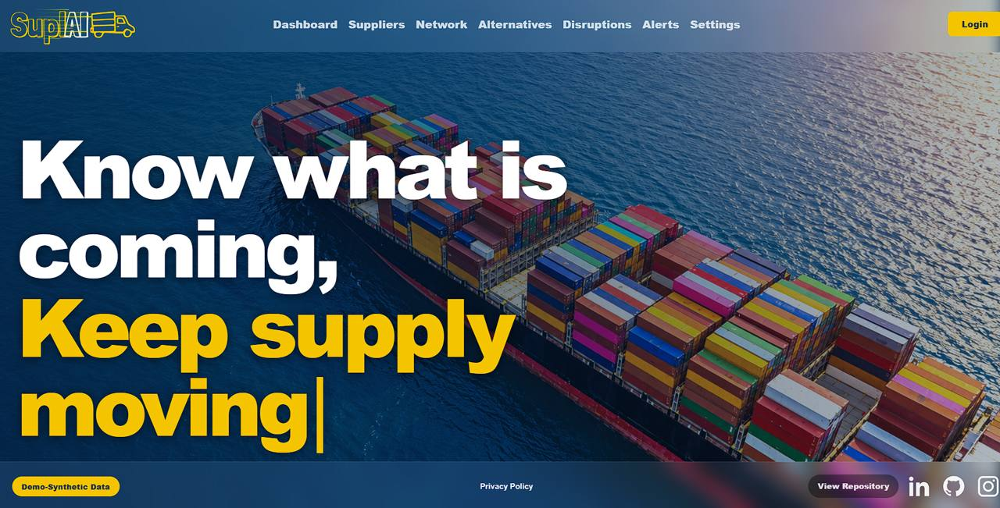
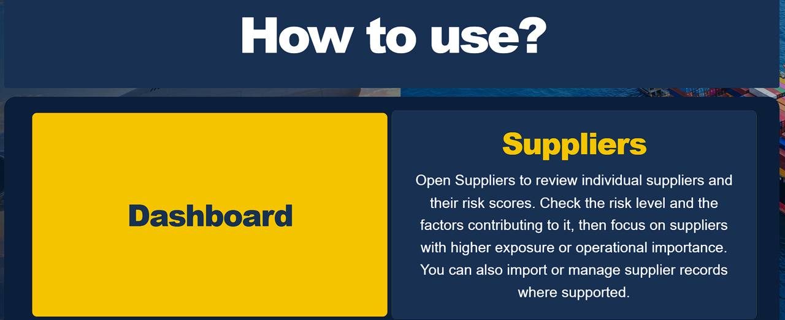
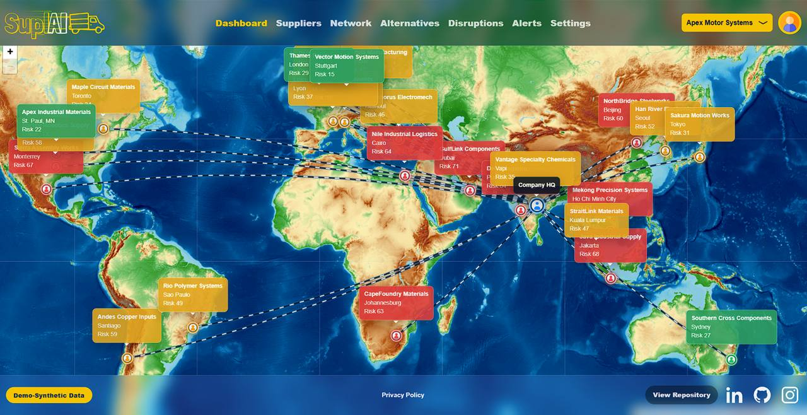
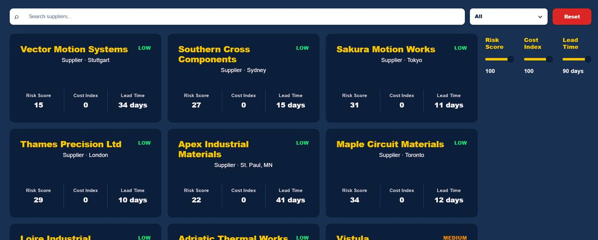
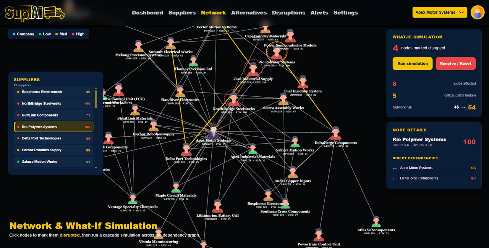
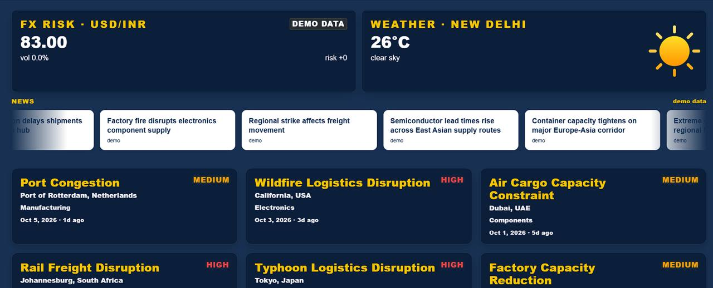
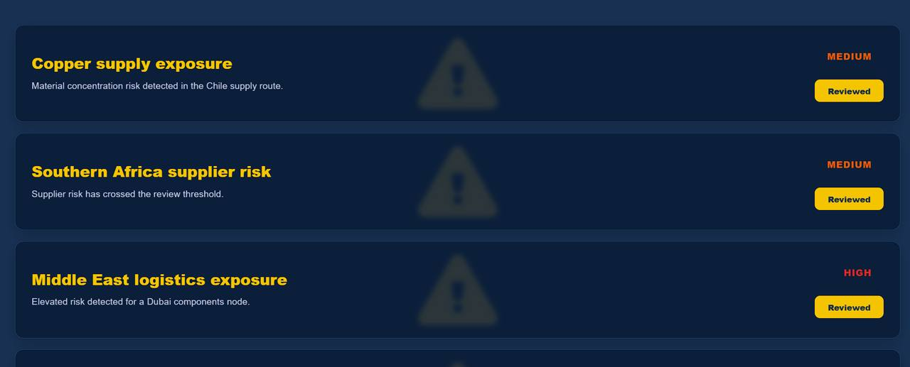
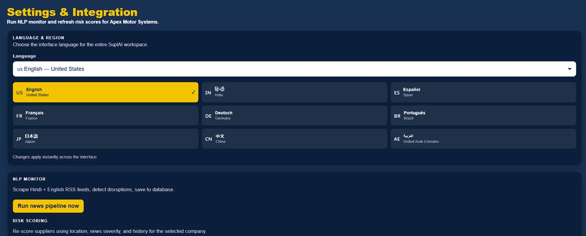
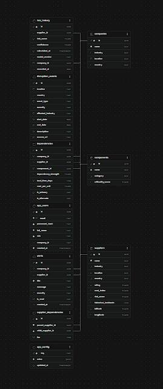

# SuplAI

> **Know what is coming. Keep supply moving.**

SuplAI is an AI-powered **supply-chain risk monitoring platform** that helps businesses monitor suppliers, visualize dependencies, detect disruptions, score risk, and simulate the impact of supplier failures.

## Features

- **Supplier Risk Management** — Track risk score, cost index, lead time, and supplier exposure.
- **Global Supply Network** — Interactive map and dependency graph for multi-tier supplier networks.
- **What-If Simulation** — Mark suppliers as disrupted and simulate cascading network impact.
- **Disruption Monitoring** — Track logistics, weather, news, and other supply-chain disruptions.
- **Risk Alerts** — Surface suppliers and events that cross configured risk thresholds.
- **Alternative Suppliers** — Explore alternative sources to reduce dependency risk.
- **NLP Monitoring** — Analyze Hindi and English news feeds for potential disruptions.
- **Multilingual UI** — Supports multiple languages and regions.
- **External Signals** — Weather, FX, geocoding, and news integrations.
- **Demo Mode** — Works with synthetic data for safe demonstrations.

## Screenshots

### Landing Page


### How to Use


### Global Supply Network


### Suppliers


### What-If Simulation


### Alternatives


### Disruptions


### Alerts


### Settings


### Database


## Tech Stack

**Frontend:** React, Vite, Leaflet, Recharts, React Force Graph  
**Backend:** Python, FastAPI, NetworkX  
**Database:** Supabase / PostgreSQL  
**Auth & Security:** JWT, role-based access, rate limiting  
**AI/NLP:** NLP-based disruption detection and risk scoring

## Quick Start

### Backend

```bash
pip install -r requirements.txt
python -m uvicorn main:app --host 127.0.0.1 --port 8000 --reload
```

### Frontend

```bash
cd frontend
npm install
npm run dev
```

Create a `.env` from `.env.example` and add the required configuration. The application can also run in **demo mode with synthetic data** when external services are not configured.

## Live Demo

**https://supl-ai.vercel.app/**

## Repository

**https://github.com/AVINASHTIWARI14/suplAI**

> **Note:** The deployed demo uses synthetic supplier, disruption, and risk data.
